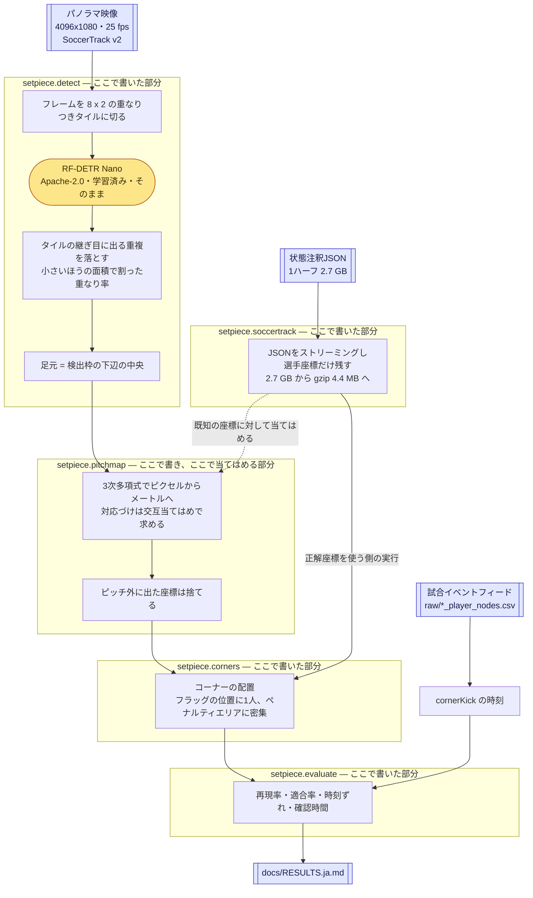
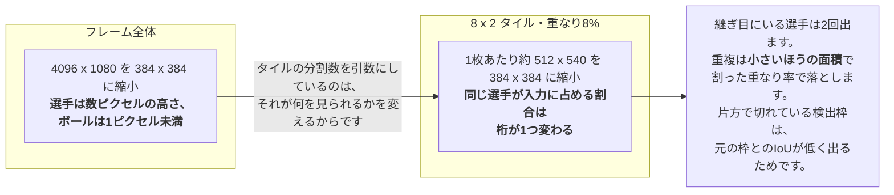
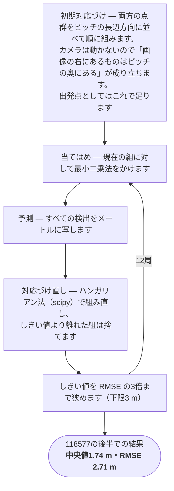

日本語 | [English](ARCHITECTURE.md)

# アーキテクチャ — 借りているものと、ここで書いたもの

このプロジェクトが土台にしているオープンソースと、このリポジトリのために書いたコードの境目を示します。あわせて、どの部分が機械学習なのかを正確に書きます。

この文書がある理由は、「サッカーのコンピュータビジョンのプロジェクト」という言葉が、ここでは事実でないことまで想像させるからです。このリポジトリで学習させたモデルはありません。追跡もチーム分類も入っていません。言語モデルも一切使っていません。

## 結論だけ先に

| | |
|---|---|
| **借りているもの** | 学習済みの物体検出器1つ（RF-DETR）、その実行基盤（PyTorch）、動画のデコーダ（OpenCV・FFmpeg）、数値計算2つ（NumPyの最小二乗、SciPyの割当問題ソルバ）です。 |
| **ここで書いたもの** | 残り全部です。タイル分割、重複除去、ピッチ座標への変換とその当てはめ処理、コーナーの判定規則、注釈ファイルのストリーミング読み取り、ラベル形式、評価器、コマンドラインです。 |
| **ここで学習させたもの** | モデル1つだけで、それはニューラルネットワークではありません。パノラマのピクセルをピッチ上のメートルに写す、係数20個の多項式です。 |
| **使っていないもの** | Ultralytics YOLO、`roboflow/sports`、あらゆる追跡器、あらゆる言語モデルです。 |

プロジェクトの後半、つまり動画ファイルを読むところから候補を教師データと突き合わせて採点するところまでは、**サードパーティ製の依存が1つもありません**。Python標準ライブラリと `ffprobe` だけで動きます。これは [DECISIONS.md](DECISIONS.ja.md) のD3として記録した意図的な選択で、モデルのダウンロードなしに3つのOSと2つのPythonバージョンでCIが回るのはこのためです。

## 全体の流れ

他人のコードは黄色の1箇所だけです。4つの枠の中身はすべて `setpiece/` にあります。

## 依存の一覧

実行時に必要なものは、これで全部です。

| パッケージ | ライセンス | ここでの実際の役割 | 使っている場所 |
|---|---|---|---|
| **rfdetr** 1.10（Roboflow） | Apache-2.0 | 人物検出器です。`RFDETRNano()` の生成と `.predict()` の呼び出しだけを使います。COCOの学習済み重みを未改変で使います | `detect.py` |
| **torch** / **torchvision** | BSD-3-Clause | RF-DETRの実行基盤です。このプロジェクトから直接呼ぶ箇所はありません | （間接） |
| **supervision**（Roboflow） | MIT | RF-DETRが検出結果を返すときの入れ物です（`.xyxy`・`.confidence`・`.class_id`） | （間接） |
| **opencv-python** | Apache-2.0 | 動画のデコードです。`VideoCapture`・`grab`・`retrieve` のみで、OpenCVの画像処理関数は使っていません | `detect.py` |
| **Pillow** | MIT-CMU | タイルを検出器が受け取る画像型に包みます | `detect.py` |
| **numpy** | BSD-3-Clause | 多項式の当てはめに使う `linalg.lstsq` と、配列演算です | `pitchmap.py` |
| **scipy** | BSD-3-Clause | `optimize.linear_sum_assignment`、つまりハンガリアン法です。検出と既知座標の対応づけに使います | `pitchmap.py` |
| **FFmpeg**（`ffprobe`） | LGPL-2.1+ | 動画ファイルの実態を読みます。`subprocess` で外部コマンドとして呼ぶだけで、リンクはしていません | `video.py` |
| **Python標準ライブラリ** | PSF | `csv`・`json`・`gzip`・`math`・`dataclasses`・`argparse`・`subprocess` | 全体 |

データはコードではありませんが、それ自体の義務を伴います。

| 出所 | ライセンス | 役割 |
|---|---|---|
| **SoccerTrack v2**（`atomscott/soccertrack-v2`） | CC BY 4.0・要承認 | 映像・選手座標・コーナーの教師データです。ここから再配布するものは何もありません（[DATA_POLICY.ja.md](DATA_POLICY.ja.md)） |

## 意図して使っていないもの

| 使わないもの | 理由 |
|---|---|
| **Ultralytics YOLO** | AGPL-3.0だからです。これをimportする公開リポジトリはAGPLを外へ引き継ぐことが期待され、この作者の他の公開物のMITライセンスと衝突します。RF-DETRはコードも重みもApache-2.0です（D2） |
| **`roboflow/sports`** | 検出→追跡→チーム分類→ホモグラフィ→ポゼッションの手順をライブラリとして提供するものです。これを使うことはこのプロジェクトが立てていない問いに答えることになり、同じものを作り直すことは何にも答えません（D1） |
| **ByteTrackなどの追跡器** | まだ書いていません。検出結果はフレーム間で対応づけていません。この点は隠さず制約として書いています |
| **データセット付属のホモグラフィ** | ピッチのメートルを配布動画のピクセルに写す変換として、どの座標系の解釈でも成立しません。そもそも継ぎ合わせたパノラマを1つのホモグラフィで記述することはできません（D9・[DATASET_NOTES.ja.md](DATASET_NOTES.ja.md)） |
| **データセット付属のボール軌跡** | 追跡できているフレームが3分の1程度で、それ以外はピッチ矩形の角にクランプされます。つまりコーナー検出器が見たがっている場所、コーナーフラッグの位置に、実在しないボールが置かれます |

## 機械学習の中身を正確に書きます

このプロジェクトには、学習させたものだと思われやすい要素が3つあります。実際に学習させているのはそのうち1つだけで、しかも最も小さいものです。

### 1. 検出器は使うだけで、学習させていません

RF-DETR Nano、パラメータ3050万のDETR系Transformer検出器を、公開されたCOCOの重みのまま読み込み、`person` クラスだけを受け取ります。このリポジトリには**ファインチューニングも転移学習もサッカー向けの学習も一切ありません**。重みを作ってもいませんし、置いてもいません。

これは手抜きではなく、実験そのものです。確かめている問いは、既製の検出器がアマチュアのパノラマ映像ですでに十分なのかどうかです。[RESULTS.ja.md](RESULTS.ja.md) がその答えを出しています。ペナルティエリアの密集については十分で、コーナーフラッグの前に1人で立つ選手については不十分です。

### 2. タイル分割が、検出器に物を見せています

このモデルは入力を何であれ 384 x 384 に縮小します。4096 x 1080 のパノラマをそのまま渡すと、選手は数ピクセルの高さにしかなりません。

実測すると、あるハーフのコーナー5場面で、注釈が挙げる22人に対し、4 x 1 の分割では毎回14人しか見つからず、キッカーは5場面とも見つかりませんでした。8 x 2 では20人から31人になります。代償も実測してあり、4Kのフレーム全体が0.035秒、3 x 2 のタイルで0.187秒です。これは高速化の工夫ではなく要件です（D7）。

### 3. ピッチ座標への変換が、ここで当てはめている唯一のモデルです

このリポジトリが行う学習は、これで全部です。

**解く問題は次のとおりです。** パノラマは複数のカメラの映像を継ぎ合わせたものなので、ピッチ上の直線が画像では直線になりません。1つの射影変換（ホモグラフィ）でフレーム全体を記述することはできません。したがって変換はデータから当てはめる必要があります。

**モデルは次のとおりです。** 画像座標を [-1, 1] に正規化したうえでの、2変数3次多項式です。

- 項は10個です（1、x、y、x²、xy、y²、x³、x²y、xy²、y³）
- 出力は2つです（ピッチのx座標とy座標、単位はメートル）
- **係数は合計20個**で、通常の最小二乗法（`numpy.linalg.lstsq`）で解きます

この20個の数値が、このプロジェクトの「学習済みの状態」のすべてです。

**難しいのは対応づけです。** 最小二乗法を使うには、どの検出がどの注釈上の選手なのかが分かっている必要がありますが、それがまさに分かりません。検出器は審判も控え選手もタッチライン際の人も拾い、逆に選手を取りこぼすので、2つの点群は個数が違ううえ、共通の識別子を持ちません。そこで対応づけと当てはめを交互に解きます。ICPやEMと同じ形です。

6周ではなく12周にしてあります。テストの合成データでは、6周では未使用データに対する誤差が6.2 mのまま残り、12周で0.09 mまで下がります。組み違いが最終的に落ちるのは最後の数周です。

**ピッチの内側で当てはめた多項式は、その外側について意味のあることを何も言いません。** しかも少し間違えるのではなく大きく間違えます。実写での最初の実行では、フレーム上方の観客や樹木を写した結果が数百メートル先の座標になりました。そのため `on_pitch()` が、タッチラインの外側12 mを超える座標を、人数を数える処理に届く前に捨てます。

**この当てはめが引き受けている前提を書いておきます。** 当てはめの相手はデータセット自身の注釈座標です。これは教師データからの意図的な借用で、幾何を正しく固定することで**認識**の損失だけを切り出すための措置です。同時にこれは、[RESULTS.ja.md](RESULTS.ja.md) のどの数値も、誰も注釈をつけていないカメラには持ち越せないことを意味します（D9）。

### 4. コーナーの判定は学習していません

`setpiece/corners.py` は手で書いた幾何の規則で、議論の対象になる設定が5つあります。

| 設定 | 既定値 | 意味 |
|---|---|---|
| `corner_radius` | 3.0 m | 選手がコーナーフラッグにどれだけ近ければよいか |
| `min_in_box` | 10 | その側のペナルティエリアにいる人数 |
| `scan_fps` | 5.0 | 座標を調べる頻度 |
| `merge_gap` | 20.0 秒 | 途切れても同じ場面とみなす長さ |
| `min_duration` | 0.0 秒 | 場面が続くべき長さ |

分類器はありませんし、データから学習したしきい値もありません。スコアらしきものは `_confidence()` の1つだけですが、これは試したうえで**ツールを悪化させることが実測されました**。試した記録ごと消えてしまうため、既定では使わない状態で残してあります。根拠は [RESULTS.ja.md](RESULTS.ja.md) にあります。

ボールとチーム識別は、意図して使っていません。どちらもデータセットには入っていますが、[DATASET_NOTES.ja.md](DATASET_NOTES.ja.md) に書いた形で信頼できません。

### 5. このプロジェクトに言語モデルはありません

ローカルでもネットワーク越しでも、大規模言語モデルを呼ぶ箇所はありません。Ollamaも、APIクライアントも、プロンプトも、文章生成も、`setpiece/` のどこにもありません。

この点を明示するのは、隣に事実である言明が2つあるからです。

- **RF-DETRはTransformerです。** 言語モデルもTransformerです。ただしRF-DETRは*検出*のTransformerで、画像を受け取って検出枠を出します。語彙もトークナイザも持たず、文字列を一切扱いません。
- **モデルは完全にローカルで動きます。** 推論はPyTorch経由でノートPC上で行われ、ネットワーク呼び出しもAPIキーもありません。重みは最初に一度だけ取得します。「ローカルのモデル」という言い方は正確ですが、「ローカルLLM」は正確ではありません。

この処理系は文章を一度も見ません。入力はピクセルとCSVの行で、出力は時刻の一覧です。

## 独自部分の所在

`setpiece/` が1,533行、`tests/` が814行あり、すべてこのプロジェクトのために書いたものです。

| モジュール | 行数 | 役割 | サードパーティ |
|---|---|---|---|
| `video.py` | 197 | `ffprobe` 経由で動画のメタデータを読みます。市販カメラが書き出すコンテナで実際に起きること（フレーム数が入っていない、ストリーム側に長さが入っていない、フレームレートが可変）に耐えます | なし |
| `timecode.py` | 77 | `12:31`・`00:12:31`・`751` を解釈し、書き出します | なし |
| `labels.py` | 130 | 教師データのCSV形式と、その語彙です | なし |
| `evaluate.py` | 169 | 候補を教師データと突き合わせます。再現率、適合率、時刻ずれの中央値、見落とした事象、候補数から逆算した確認時間を出します | なし |
| `soccertrack.py` | 191 | 2.7 GBの整形済みJSONを、スライドさせたバッファ上の `raw_decode` でストリーミングし、その1%にあたる選手座標だけを残します。イベントフィードからはコーナーキックを読み、時刻・前後半・チームIDだけを取ります | なし |
| `corners.py` | 155 | コーナーの判定規則です | なし |
| `detect.py` | 162 | タイルの分割、重複除去、足元の算出、検出結果のキャッシュです | rfdetr・opencv・Pillow |
| `pitchmap.py` | 184 | 多項式による変換、交互当てはめ、ピッチ外の除外です | numpy・scipy |
| `cli.py` | 255 | 6つのサブコマンドです | なし |

依存を持つ2つのモジュールは、**必要な関数の中で**importします。そのためtorchが入っていなくてもパッケージの残りは動き、テストも全部走ります。

## 結果を読むときに、この構成が意味すること

検出器は既製品で、コーナーの規則は手書きなので、[RESULTS.ja.md](RESULTS.ja.md) の数値は学習させた系についての主張ではありません。既製の検出器と幾何だけでこの映像にどこまで通用するかを、正直に測った結果です。そして失敗の所在も1箇所に特定してあります。継ぎ合わせたパノラマの端で1人だけコーナーフラッグの前に立つ選手は、ピッチ上で最も検出が難しい対象であり、判定規則はまさにその1人に全体重を預けています。
