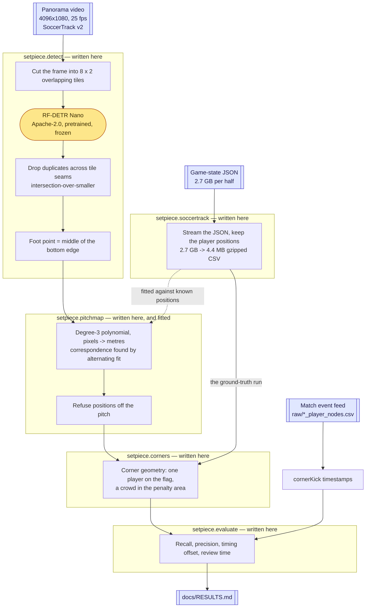
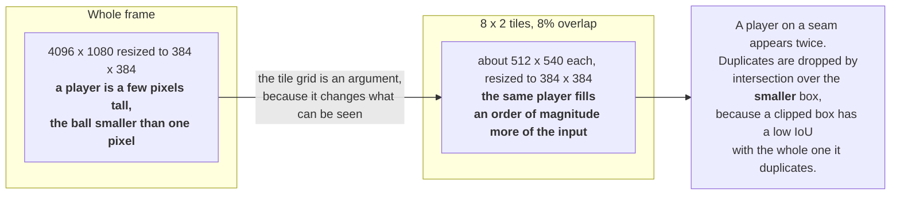
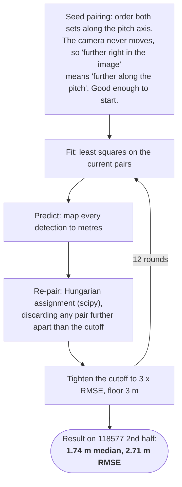

[日本語](ARCHITECTURE.ja.md) | English

# Architecture: what is borrowed, and what is written here

This document draws the line between the open-source software this project
runs on and the code written for it, and states exactly what part of it is
machine learning.

It exists because "a football computer-vision project" implies a great deal
that is not true here. There is no model trained in this repository, no
tracker, no team classifier, and no language model of any kind.

## The short answer

| | |
|---|---|
| **Borrowed** | One pretrained object detector (RF-DETR), its runtime (PyTorch), a video decoder (OpenCV, FFmpeg), and two numerical routines (NumPy's least squares, SciPy's assignment solver). |
| **Written here** | Everything else: the tiling scheme, the duplicate removal, the pitch mapping and its fitting loop, the corner heuristic, the streaming annotation reader, the label format, the evaluator, and the command line. |
| **Trained here** | One model, and it is not a neural network: a 20-coefficient polynomial that maps panorama pixels to pitch metres. |
| **Not used at all** | Ultralytics YOLO, `roboflow/sports`, any tracker, any language model. |

The measurement half of the project — everything from reading a video file to
scoring candidates against ground truth — has **zero third-party dependencies**.
It runs on the Python standard library plus the `ffprobe` binary. That is a
deliberate choice recorded as D3 in [DECISIONS.md](DECISIONS.md), and it is why
CI runs on three operating systems and two Python versions without a model
download.

## The pipeline

Only the amber node is other people's code. Everything in the four subgraphs
is in `setpiece/`.

## Dependency inventory

Runtime dependencies, all of them:

| Package | Licence | What it actually does here | Used by |
|---|---|---|---|
| **rfdetr** 1.10 (Roboflow) | Apache-2.0 | The person detector. `RFDETRNano()` and one call to `.predict()`. Pretrained COCO weights, unmodified. | `detect.py` |
| **torch** / **torchvision** | BSD-3-Clause | RF-DETR's runtime. Never called directly by this project. | (transitive) |
| **supervision** (Roboflow) | MIT | The container RF-DETR returns its boxes in (`.xyxy`, `.confidence`, `.class_id`). | (transitive) |
| **opencv-python** | Apache-2.0 | Decoding the video: `VideoCapture`, `grab`, `retrieve`. Nothing else — no OpenCV vision routine is used. | `detect.py` |
| **Pillow** | MIT-CMU | Wrapping a tile as the image type the detector expects. | `detect.py` |
| **numpy** | BSD-3-Clause | `linalg.lstsq` for the polynomial fit, and array arithmetic. | `pitchmap.py` |
| **scipy** | BSD-3-Clause | `optimize.linear_sum_assignment` — the Hungarian algorithm, for pairing detections with known positions. | `pitchmap.py` |
| **FFmpeg** (`ffprobe`) | LGPL-2.1+ | Reading what a video file is. Called as an external binary through `subprocess`, never linked. | `video.py` |
| **Python standard library** | PSF | `csv`, `json`, `gzip`, `math`, `dataclasses`, `argparse`, `subprocess`. | everything |

Data, which is not code but carries obligations of its own:

| Source | Licence | Role |
|---|---|---|
| **SoccerTrack v2** (`atomscott/soccertrack-v2`) | CC BY 4.0, gated | The footage, the player positions, and the corner ground truth. Nothing from it is redistributed here — see [DATA_POLICY.md](DATA_POLICY.md). |

## What is deliberately not used

| Not used | Why |
|---|---|
| **Ultralytics YOLO** | AGPL-3.0. A public repository that imports it is expected to carry AGPL outward, which conflicts with the MIT licence on the rest of this author's work. RF-DETR is Apache-2.0 for both code and weights. See D2. |
| **`roboflow/sports`** | It ships the detect → track → team → homography → possession recipe as a library. Using it would answer a question the project is not asking; rebuilding it would answer nothing at all. See D1. |
| **ByteTrack, or any tracker** | Not written yet. Detections are matched to nothing between frames. This is stated as a limitation, not hidden. |
| **The dataset's bundled homography** | It does not project pitch metres to the pixels of the distributed video in any convention that works, and a single homography cannot describe a stitched panorama anyway. See D9 and [DATASET_NOTES.md](DATASET_NOTES.md). |
| **The dataset's ball track** | Live for about a third of the frames, and clamped to the pitch corner when it is not — which places a phantom ball on the corner flag exactly where a corner detector wants to see one. |

## The machine learning, precisely

Three things in this project are often assumed to be learned. Only one of them
is, and it is the smallest.

### 1. The detector is used, not trained

RF-DETR Nano — 30.5 M parameters, a DETR-family Transformer detector — is
loaded with its published COCO weights and asked for the `person` class. There
is **no fine-tuning, no transfer learning, no football-specific training** in
this repository. No weights are produced, and none are stored.

That is not a shortcut, it is the experiment: the question being tested is
whether an off-the-shelf detector is already good enough on panoramic amateur
footage. [RESULTS.md](RESULTS.md) answers it — for the crowd in the penalty
area, yes; for the lone player on the corner flag, no.

### 2. Tiling is what makes the detector see anything

The model resizes whatever it is given to 384 x 384. Handing it a whole 4096 x
1080 panorama leaves a player a handful of pixels tall.

Measured effect, on the five corner frames of one half, against the 22 people
the annotation lists: a 4 x 1 grid finds 14 people every time and never finds
the corner taker; 8 x 2 finds 20 to 31. The cost is real — 0.035 s per whole 4K
frame against 0.187 s at 3 x 2 — and it is a requirement rather than an
optimisation. This is D7.

### 3. The pitch mapping is the one model fitted here

This is the whole of the learning this repository does.

**The problem.** The panorama is stitched from several cameras, so straight
lines on the pitch are not straight in the image and no single projective
transform (homography) describes the frame. A mapping has to be fitted from
data.

**The model.** A bivariate polynomial of degree 3, on image coordinates
normalised to [-1, 1]:

- 10 monomial terms — 1, x, y, x², xy, y², x³, x²y, xy², y³
- 2 outputs — pitch x and pitch y in metres
- **20 coefficients in total**, solved by ordinary least squares
  (`numpy.linalg.lstsq`)

Twenty numbers is the entire "trained" state of this project.

**The difficulty.** Least squares needs to know which detection corresponds to
which annotated player, and that is exactly what is unknown: the detector finds
referees, substitutes and people on the touchline, and misses players, so the
two point sets are of different sizes with no shared identity. So the
correspondence and the fit are solved alternately — the same shape as ICP or
EM.

Twelve rounds, not six: on the synthetic case in the tests, six rounds leave a
held-out error of 6.2 m and twelve bring it to 0.09 m. The last few rounds are
where the mismatched pairs finally fall out.

**A polynomial fitted inside the pitch says nothing sensible outside it**, and
it fails loudly rather than quietly — a spectator or a tree high in the frame
mapped to a position hundreds of metres away in the first run on real footage.
So `on_pitch()` refuses anything more than 12 m outside the touchline before it
reaches anything that counts people.

**What this fit costs in honesty.** It is fitted against the dataset's own
annotated positions. That is a deliberate loan from the ground truth: holding
the geometry correct is what isolates the cost of *perception*. It also means
no number in [RESULTS.md](RESULTS.md) transfers to a camera nobody has
annotated. This is D9.

### 4. The corner spotter is not learned at all

`setpiece/corners.py` is a hand-written geometric rule with five arguable
settings:

| Setting | Default | What it means |
|---|---|---|
| `corner_radius` | 3.0 m | How close a player must be to the corner flag |
| `min_in_box` | 10 | People inside the penalty area at that end |
| `scan_fps` | 5.0 | How often the positions are examined |
| `merge_gap` | 20.0 s | Interruption still counted as one situation |
| `min_duration` | 0.0 s | How long a situation must last |

No classifier, no threshold learned from data. The one score-like number in the
file, `_confidence()`, was tried and **measured to make the tool worse**; it is
left in place, unused by default, so that the record of having tried it is not
deleted. The evidence is in [RESULTS.md](RESULTS.md).

Deliberately, the ball is not used and team identity is not used. Both are
available in the dataset and both are unreliable in the ways recorded in
[DATASET_NOTES.md](DATASET_NOTES.md).

### 5. There is no language model in this project

Nothing here calls a large language model, locally or over a network. There is
no Ollama, no API client, no prompt, and no text generation anywhere in
`setpiece/`.

The confusion is worth naming, because two true statements sit close to it:

- **RF-DETR is a Transformer**, and so are language models. It is a *detection*
  Transformer — it consumes an image and emits boxes. It has no vocabulary, no
  tokeniser, and no text of any kind.
- **The model runs entirely locally.** Inference happens on the laptop through
  PyTorch, with no network call and no API key, and the weights are downloaded
  once. "A local model" is accurate; "a local LLM" is not.

The pipeline never sees text. Its inputs are pixels and CSV rows, and its
output is a list of timestamps.

## Where the original work is

`setpiece/` is 1,533 lines and `tests/` is 814, all written for this project.

| Module | Lines | What it does | Third-party |
|---|---|---|---|
| `video.py` | 197 | Reads video metadata through `ffprobe`, and survives what consumer cameras write: absent frame counts, absent stream durations, variable frame rates. | none |
| `timecode.py` | 77 | Parses and prints `12:31` / `00:12:31` / `751`. | none |
| `labels.py` | 130 | The ground-truth CSV format and its vocabulary. | none |
| `evaluate.py` | 169 | Scores candidates against labels: recall, precision, median offset, what was missed, implied review time. | none |
| `soccertrack.py` | 191 | Streams a 2.7 GB pretty-printed JSON with `raw_decode` over a sliding buffer, keeping the 1% of it that is player positions. Reads corner kicks from the event feed, taking only the timestamp, period and team id. | none |
| `corners.py` | 155 | The corner heuristic. | none |
| `detect.py` | 162 | The tile grid, the duplicate removal, the foot point, the detection cache. | rfdetr, opencv, Pillow |
| `pitchmap.py` | 184 | The polynomial mapping, the alternating fit, the off-pitch gate. | numpy, scipy |
| `cli.py` | 255 | Six subcommands. | none |

The two modules with dependencies import them **inside the function that needs
them**, so the rest of the package keeps working — and the whole test suite
keeps running — without torch installed.

## What this means when reading the results

Because the detector is off-the-shelf and the corner rule is hand-written, the
numbers in [RESULTS.md](RESULTS.md) are not a claim about a trained system.
They are a claim about how far a stock detector plus geometry gets on this
footage, measured honestly, with the failure attributed to a specific place:
the lone player standing at the corner flag, at the edge of a stitched
panorama, is the hardest detection on the pitch, and the heuristic leans its
whole weight on exactly that person.
